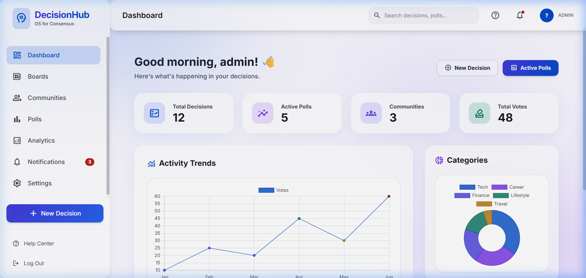

# 🚀 DecisionHub

> A modern, premium Collaborative Decision-Making & Community Polling Platform built using **Java Spring Boot**, **React.js**, and **PostgreSQL/H2**.

---

## 📸 Preview

Here is a preview of the main Analytics Dashboard in DecisionHub:



---

## 📌 Overview

**DecisionHub** is a full-stack web application designed to help individuals, teams, and communities make consensus-based decisions through structured option comparison tables, discussions, polls, and interactive dashboards.

Users can:
*   Create and manage custom **Decision Boards**.
*   Map and compare options using multi-factor rating scales with custom weights.
*   Discuss the options in threaded **Community Discussions**.
*   Analyze pros/cons and cast votes in interactive **Community Polls**.

---

## ✨ Features

*   🔐 **JWT-based Authentication** with support for both username and email credentials.
*   📊 **Analytics Dashboard** featuring dynamic Chart.js visualizations (Activity Trends, Category distributions).
*   ⚖️ **Option Comparison Table** to calculate scores dynamically based on user-defined factors.
*   💬 **Threaded Comments** allowing structured discussions and replies on decision cards.
*   🗳️ **Community Polls** supporting custom types (single-choice, multi-choice, anonymous voting).
*   🔔 **Real-time Notifications** to notify users of comments, updates, and newly cast votes.
*   👥 **Community Management** to invite users and collaborate in private/public spaces.
*   📄 **PDF & Excel Reports** for decision documentation.

---

## 🛠️ Tech Stack

### Frontend
*   **Vite + React.js (ES6+)**
*   **Tailwind CSS** for premium, modern styling.
*   **Axios** for stateful API calls.
*   **Chart.js + React-Chartjs-2** for interactive graphs.
*   **React Router Dom** for client-side routing.

### Backend
*   **Java 17 & Spring Boot 3**
*   **Spring Security** + Stateless **JWT Authentication**.
*   **Spring Data JPA** with Hibernate ORM.
*   **H2 Database** (configured for development/in-memory test execution) & PostgreSQL support.

---

## 🚀 Getting Started

### Prerequisites
*   **Java JDK 17** installed.
*   **Node.js** (v18+) and **npm** installed.

---

### Step-by-Step Execution

#### 1. Start the Backend
Open a terminal in the `backend` directory. Run the server using the configured Maven Wrapper (`mvnw.cmd` on Windows, `./mvnw` on Unix):

**On Windows:**
```powershell
$env:JAVA_HOME = "C:\Program Files\Java\jdk-17"
.\mvnw.cmd spring-boot:run
```

**On Linux / macOS:**
```bash
./mvnw spring-boot:run
```

*The backend runs on **http://localhost:8080**. It will automatically bootstrap a default database with an admin account.*

*   **Default Admin Email:** `admin@decisionhub.com`
*   **Default Admin Password:** `admin123`

---

#### 2. Start the Frontend
Open a new terminal in the `frontend` directory:

```bash
npm install
npm run dev
```

*The development server will start on **http://localhost:5173**. Access this address in your browser to sign in.*

---

## 📂 Project Structure

```text
DecisionHub
│
├── backend                  # Spring Boot App
│   ├── .mvn/wrapper         # Local Maven Wrapper configurations
│   ├── src/main/java        # Controllers, Services, Entities, Repositories, Security config
│   └── src/main/resources   # App properties & database configuration
│
├── frontend                 # React App
│   ├── src/components       # Reusable components (Charts, Modals, Widgets)
│   ├── src/context          # Auth & API Contexts
│   ├── src/pages            # Routed views (Dashboard, Decisions, Profile, Reports)
│   └── src/services         # Axios API connection services
│
└── docs                     # Architecture blueprints and assets
```

---

## 👨•💻 Author

**Karthik T S**  
*Final Year Computer Science Engineering Student*
